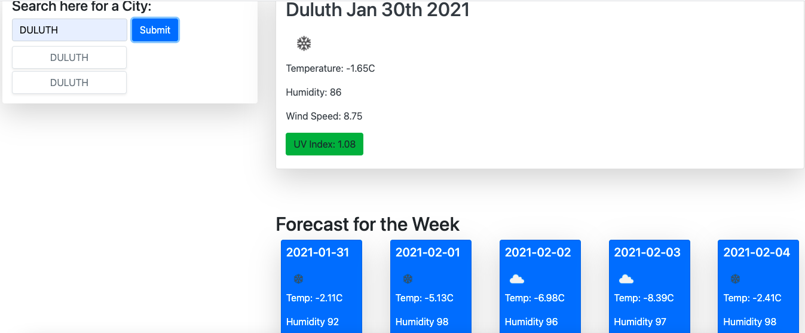

# weather_dashboard

## Installation/Deployment

Open the html file in the browser. Another option is to go to this link: <https://github.com/skimmers/weather_dashboard> and examine the html, css, and javascript files.

Please check to see if the assignment goals are met.

## Goal

The goal is to create a weather dashboard. I'm supposed to use an api in order to dynamically list the weather forecast for the current day and the upcoming days. 

These are the requirements I had to meet: 

* GIVEN a weather dashboard with form inputs
* WHEN I search for a city
* THEN I am presented with current and future conditions for that city and that city is added to the search history
* WHEN I view current weather conditions for that city
* THEN I am presented with the city name, the date, an icon representation of weather conditions, the temperature, the humidity,  the wind speed, and the UV index
* WHEN I view the UV index
* THEN I am presented with a color that indicates whether the conditions are favorable, moderate, or severe
* WHEN I view future weather conditions for that city
* THEN I am presented with a 5-day forecast that displays the date, an icon representation of weather conditions, the temperature, and the humidity
* WHEN I click on a city in the search history
* THEN I am again presented with current and future conditions for that city
* WHEN I open the weather dashboard
* THEN I am presented with the last searched city forecast

## My Weather Dashboard

Please see an image of my application:

# Purpose

I believe the purpose of this assignment was to test my abilities in CSS, HTML, JavaScript, and teach me how to use APIs. I obviously do not have an application that works. I amd struggling to understand how to utilize the API and write the JavaScript for this. I will be resubmitting this in the future. 
